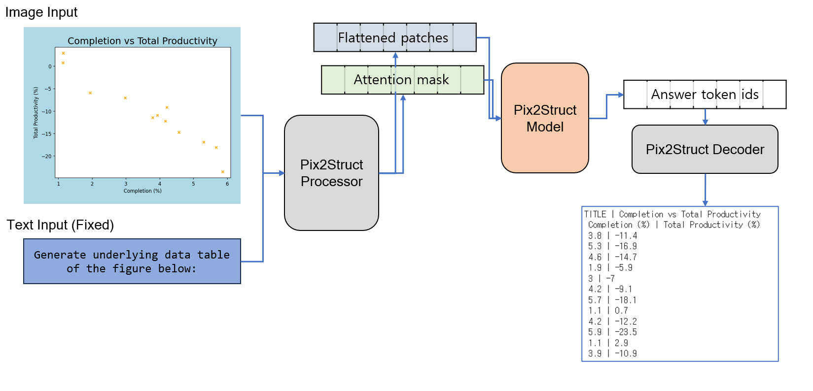
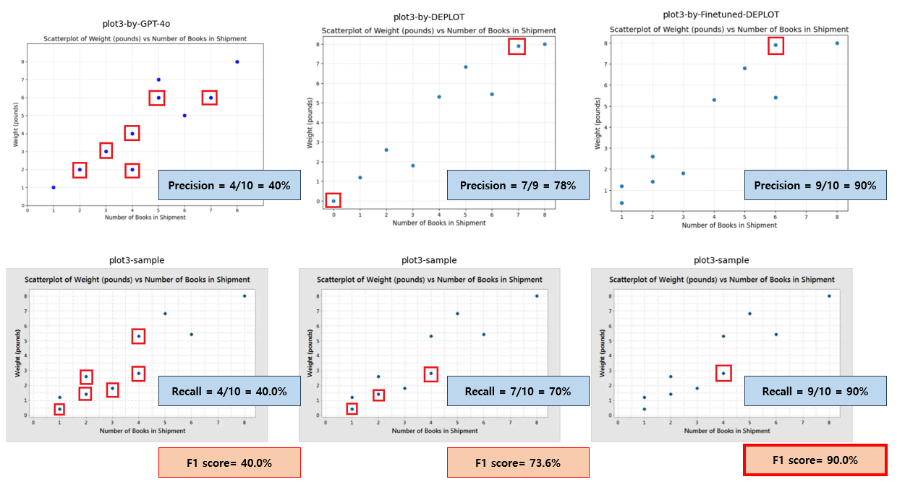

# Scatterplot-to-Table Conversion with Fine-Tuned DePlot

This project fine-tunes the DePlot model to convert scatterplot images into structured tables, achieving a 74.9% F1 score—a 52% improvement over the baseline. Built with Vision Transformers and a custom dataset, it addresses the limitations of existing models in handling scatterplots.

  

<!-- 마크다운으로 주석 처리 가능 
**[Try the Demo](https://huggingface.co/spaces/1Park/scatterplot-to-table)** | [Dataset](https://drive.google.com/drive/folders/1L-ammRM4XdNb7Bbb4NzXnefnH2TMFu?usp=sharing) | [Model-Not Ready](https://drive.google.com/drive/folders/19ZleESBIPtuy8PYoRca9nezZdjQdAct?usp=sharing)


  
*From scatterplot to table in seconds.*

-->.

## 🔍 Overview

- **Problem**: Existing models struggle to convert scatterplots into tables due to dataset biases.  
- **Solution**: Fine-tuned DePlot with 2,500 custom scatterplot images, improving F1 score to 74.9%.  
- **Impact**: Enhanced the multimodal model's abillity to analyze documents and images that include scatterplot.
## ⚙️ How It Works

1. **Dataset Creation**: Generated 10,500 scatterplot images using Matplotlib, covering random, linear, and clustered patterns.  
2. **Fine-Tuning**: Adapted DePlot's pix2struct model, trained on 2,000 images with a fixed prompt: "Generate underlying data table."  
3. **Evaluation**: Achieved 83% precision and 69% recall on a 100-image test set.


 
*Overview of the fine-tuning process.*


## 📊 Results

- **Quantitative**: Outperformed baseline DePlot and GPT-4o:  
  | Model | F1 Score | Precision | Recall |  
  |-------|----------|-----------|--------|  
  | Baseline DePlot | 22.9% | 30.8% | 19.5% |  
  | Fine-Tuned DePlot | **74.9%** | **83.0%** | **69.0%** |  

- **Qualitative**: Accurately captures complex scatterplot patterns, reducing errors significantly.  


  
*Comparison of GPT-4o, Baseline DePlot, and Fine-Tuned DePlot on a real-world scatterplot.*

## 📑[Detailed Report](./documents/COSE474_2024__DL_Final_Project_Report.pdf)
🙌[Baseline Model (DEPLOT) ](https://huggingface.co/google/deplot)
<!--

## 🚀 Try It Yourself

```python
from transformers import Pix2StructProcessor, Pix2StructForConditionalGeneration
processor = Pix2StructProcessor.from_pretrained("1Park/finetuned-deplot")
model = Pix2StructForConditionalGeneration.from_pretrained("1Park/finetuned-deplot")
image = "scatterplot.png"
inputs = processor(images=image, text="Generate underlying data table:", return_tensors="pt")
outputs = model.generate(**inputs)
print(processor.decode(outputs[0], skip_special_tokens=True))
```
-->
## 🔮 Future Work

1. Expand dataset to include line and bar charts for broader applicability.  
2. Test on real-world datasets to ensure robustness.  
3. Integrate with LLMs for advanced tasks like regression analysis.

<!--
## 📚 Who Can Use This?

- **Data Analysts**: Extract structured data from scatterplots for reporting.  
- **Researchers**: Automate data collection from scientific plots.  
- **Developers**: Build tools for business intelligence or visualization.

-->
